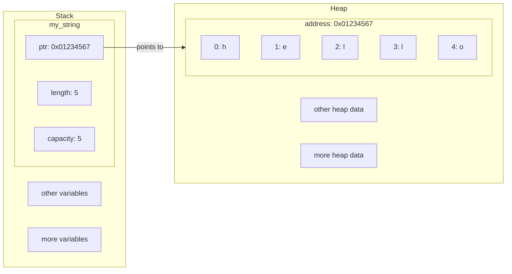
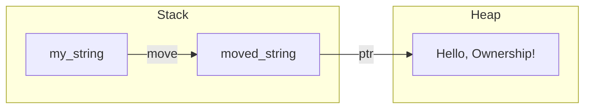

## Ownership in Rust

**Key Concept**: Ownership is Rust's memory management system that guarantees safety and efficiency without the need for a garbage collector, through strict rules about ownership and the data lifecycle.

---

### 📚 Fundamental Concepts

Ownership is the central pillar of Rust for memory management and compile-time safety. Understanding ownership is essential to avoid common errors such as memory leaks, dangling pointers, and race conditions.

- **Ownership**: 
  - **Each value in Rust has a unique owner:**
  - **There can only be one owner at a time.**
  - **When the owner goes out of scope, the value is dropped.**
- **Move**: When assigning or passing a value to another variable or function, ownership is transferred (move) and the original variable becomes invalid.
- **Copy**: Simple types (such as integers) implement the `Copy` trait, allowing the value to be duplicated without transferring ownership.
- **Stack vs Heap**: Rust differentiates between data stored on the stack (fixed size, fast) and heap (dynamic size, requires ownership management).

#### Golden Rules of Ownership

1. **Each value has a unique owner:** Only one variable can own a value at any given time. This prevents ambiguities about who should free the memory and avoids errors like double free or data corruption. In this way, Rust guarantees that there is always a clear responsible subjet for the resource.
2. **There can only be one owner at a time.** When assigning or passing the value to another variable or function, ownership is transferred and the original variable is no longer valid. This avoids risks of using invalid data (dangling pointers) and ensures that only one part of the code can modify or free the resource.
3. **When the owner goes out of scope, the value is freed:** Rust automatically frees the memory when the owning variable goes out of scope, preventing memory leaks and manual releases. This reduces human errors and makes resource management safer and more predictable.

#### Diagram: Stack vs Heap



---


### 💡 Practical Examples

#### Example 1: Ownership Transfer (move)

```rust
fn main() {
    let my_string: String = String::from("Hello, Ownership!");
    println!("Original string: {}", my_string);
    let moved_string: String = my_string;
    println!("Now moved_string is the owner: {}", moved_string);
    // println!("Trying to use my_string: {}", my_string); // Compilation error
}
```

**Explanation**: When assigning `my_string` to `moved_string`, ownership is transferred. Using `my_string` after the transfer results in a compile-time error.



#### Example 2: Copy of Primitive Types (Copy)

```rust
fn main() {
    let my_number: i32 = 42;
    println!("Original number before copy_example(): {}", my_number);
    let copied_number: i32 = my_number;
    println!("Copied number: {}", copied_number);
    println!("Original number after copy: {}", my_number);
}
```

**Explanation**: Primitive types implement the `Copy` trait, so the assignment creates a copy and both variables are valid.

#### Example 3: Ownership in Functions

```rust
fn get_ownership_example(some_string: String) {
    println!("Hi!, i'm inside the function get_ownership_example()");
    println!("I'm the owner of the string: {}", some_string);
    println!("When this function ends, the string will be dropped.");
}

fn main() {
    let my_string: String = String::from("Hello, Rust!");
    println!("Original string: {}", my_string);
    get_ownership_example(my_string);
    // println!("Trying to use my_string: {}", my_string); // Compilation error
}
```

**Explanation**: When passing `my_string` to the function, ownership is transferred and the original variable becomes invalid after the call.

#### Example 4: Returning Ownership from Functions

```rust
fn give_a_ownership() -> String {
    let some_string: String = String::from("Hello, I'm gifted to you!");
    println!("Hi!, i'm give_a_ownership(). I'm creating a string and giving you ownership of it.");
    println!("The string is: {}", some_string);
    println!("Enjoy your new string!");
    some_string
}

fn take_and_give_back_ownership(a_string: String) -> String {
    println!("Hi!, i'm take_and_give_back_ownership(). I'm taking ownership of your string.");
    println!("The string is: {}", a_string);
    println!("Now, I'm giving the ownership back to you.");
    println!("Enjoy your string again!. Thank you for trusting me with it.");
    a_string
}

fn main() {
    let new_string: String = give_a_ownership();
    println!("Received string from give_a_ownership(): {}", new_string);
    let returned_string: String = take_and_give_back_ownership(new_string);
    println!("Received string back from take_and_give_back_ownership(): {}", returned_string);
}
```

**Explanation**: Functions can transfer ownership by returning values. This way, ownership can "travel" between functions and variables.

#### Example 5: Ownership and Scope

```rust
fn main() {
    {
        let s = String::from("scoped");
        println!("Inside scope: {}", s);
    } // s is automatically freed here
    // println!("Outside scope: {}", s); // Error: s no longer exists
}
```

**Explanation**: When a variable goes out of scope, Rust automatically frees the associated memory.

---


### ⚠️ Important Points

- **No double free**: Rust prevents errors like double free by invalidating the original variable after a move.
- **No dangling pointers**: When transferring ownership, Rust guarantees that there are no invalid references.
- **Copy vs Move**: Only types that implement `Copy` (integers, bool, char, etc.) can be copied; others are moved.
- **Borrowing and references**: Ownership is the foundation for the borrowing system (borrowing), which allows temporary references without transferring ownership. Next, we will explore this concept in detail.
- **Golden rules**: Always remember the three fundamental rules of ownership.

---


### 🔗 Relations and Context

**Related previous topics**:
- [Variables and data types](../01_Fundamentals/02_Variables.md)
- [Functions in Rust](../01_Fundamentals/03_Functions.md)
- [Control flow](../01_Fundamentals/04_Control_Flow.md)

**Prerequisites**:
- Understand stack and heap
- Primitive and complex types

**Next topics**:
- [Borrowing and references](02_Borrowing.md)
---


### 📖 References

- [Rust Book - Chapter 4: Ownership](https://doc.rust-lang.org/book/ch04-00-understanding-ownership.html)