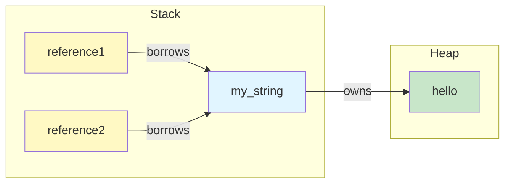
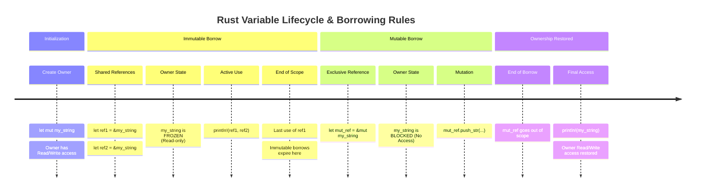

## Borrowing in Rust

**Key Concept**: Borrowing allows you to access data without taking ownership through references (`&` for immutable, `&mut` for mutable). Rust enforces strict borrowing rules at compile time to prevent data races and ensure memory safety.

---

### 📚 Fundamental Concepts

Borrowing is Rust's mechanism for accessing data without transferring ownership. It provides two types of references, each with different rules and purposes:

- **Immutable References (`&T`)**: Created with the `&` syntax, immutable references allow read-only access to data. Multiple immutable references can point to the same data simultaneously because no one is modifying it. The data cannot be changed through an immutable reference, but the original variable remains usable. You can create an immutable reference from both mutable and immutable bindings, but you cannot modify through it
  
- **Mutable References (`&mut T`)**: Created with the `&mut` syntax, mutable references allow you to read AND modify the borrowed data. However, only one mutable reference can exist at a time to prevent data races. The original variable must be declared with `mut` to enable mutable borrowing. While a mutable reference exists, no immutable references can be created, and the original variable cannot be directly accessed
  
- **The Core Borrowing Rules**: Rust enforces three compile-time rules to ensure memory safety:
  1. You can have ANY number of immutable references to the same data
  2. You can have exactly ONE mutable reference to the same data at a time
  3. You cannot have both immutable and mutable references to the same data simultaneously
  
  These rules eliminate entire classes of bugs like data races and use-after-free errors by preventing multiple threads from modifying data concurrently and ensuring references never point to deallocated memory

- **Scope and Reference Duration**: A reference's scope extends from where it's created until its last use, not necessarily until the end of the block. This means you can create a new reference (especially a mutable one) after the previous references are no longer being used, even if they were declared earlier in the same block. Understanding this is crucial because it allows more flexible borrowing patterns

---

### 💡 Practical Examples

#### Example 1: Immutable References

```rust
fn main() {
    let my_string = String::from("hello");

    // Create immutable references
    let reference1 = &my_string;
    let reference2 = &my_string;
    
    // We can have multiple immutable references to the same data at the same time
    println!("Reference 1: {}", reference1);
    println!("Reference 2: {}", reference2);
    // Original variable is still accessible
    println!("Original string: {}", my_string);
}
```

**Explanation**: The `&` syntax creates immutable references. Multiple immutable references can point to the same data simultaneously because no one is modifying it. The original variable `my_string` remains accessible even while being borrowed.

Memory visualization:



---

#### Example 2: Borrowing in Function Calls

```rust
fn calculate_length(some_string: &String) -> usize {
    // & indicates a reference
    // Now we can use some_string without taking ownership of it.
    println!("Inside calculate_length: {}", some_string);
    some_string.len()
    // We can't modify some_string here because it's an immutable reference.
    // By default, references are immutable like a variable declared with "let".
} // We return the length of the String without taking ownership

fn main() {
    let my_string = String::from("hello");
    
    // Create an immutable length using a reference to my_string
    // Here, we are borrowing my_string immutably, DO NOT take ownership.
    let len = calculate_length(&my_string);

    // Now we can still use my_string because we only borrowed it.
    println!("The length of '{}' is {}.", my_string, len);
}
```

**Explanation**: The function `calculate_length` takes an immutable reference to a `String`. The `&my_string` syntax borrows the string without transferring ownership. After the function returns, `my_string` is still valid and can be used again. This is different from ownership transfer, where the original variable would be inaccessible after the function call.

---

#### Example 3: Mutable References

```rust
fn modify_string(s: &mut String) {
    // We can modify the String because we have a mutable reference
    println!("Inside modify_string before modification: {}", s);
    println!("Modifying the string Muejeje...");
    // Append text to the String
    s.push_str(", dude!");
    println!("Now the string is: {}", s);
    println!("Godbye from modify_string!")
}

fn main() {
    let mut my_string = String::from("hello");

    // Borrow my_string mutably
    modify_string(&mut my_string);
    
    // Now we can see the modified string
    println!("The modified string is: {}", my_string);
}
```

**Explanation**: A mutable reference (`&mut`) allows the function to modify the borrowed data. The original variable must be declared with `mut` to enable mutable borrowing. After `modify_string` returns, the modifications persist and `my_string` still exists with the updated value. Only one mutable reference can exist at a time.

---

#### Example 4: Immutable and Mutable References Cannot Coexist

```rust
fn main() {
    let mut my_string = String::from("hello");

    // Create immutable references
    let reference1 = &my_string;
    let reference2 = &my_string;
    println!("Reference 1: {}", reference1);
    println!("Reference 2: {}", reference2);

    // We cannot have a mutable reference while we have immutable references
    // Uncommenting the next line will cause a compile-time error:
    // let mutable_reference = &mut my_string; // Error!
    
    println!("Using reference1 again: {}", reference1);

    // Now we can create a mutable reference after the immutable ones are no longer used
    let mutable_reference = &mut my_string;
    mutable_reference.push_str(" world");
    println!("After using mutable reference: {}", mutable_reference);
    
    // Now we can still use my_string because we only borrowed it.
    println!("The final string is: {}", my_string);
}
```

**Explanation**: This example demonstrates Rust's most important borrowing rule—you cannot have both mutable and immutable references to the same data at the same time. This prevents data races at compile time. Once all immutable references go out of scope (after their last use), you can create a mutable reference. After the mutable reference is used, the original variable is still valid.

Reference lifetime visualization:



The diagram shows the critical insight:
- `reference1` and `reference2` (immutable) allow the original `my_string` to be accessible
- After immutable references are done, `mutable_reference` is created and takes exclusive access
- While `mutable_reference` is active, the original `my_string` is **NOT accessible** at all (neither for reading nor writing)
- After `mutable_reference` is done, `my_string` becomes accessible again

---

### ⚠️ Important Points

- **Original Must Be Mutable**: To create a `&mut` reference, the original variable must be declared with `mut`. You cannot borrow mutably from an immutable binding
- **No Mixed References**: You cannot have immutable and mutable references to the same data simultaneously. The compiler prevents this to avoid data races
- **Scope Matters**: A reference is only active until its last use, not until the end of the block. You can create a mutable reference after immutable ones finish being used
- **Borrowing Doesn't Transfer Ownership**: Using `&` or `&mut` passes a reference, not ownership. The original variable remains valid and usable after the borrow ends
- **One Mutable at a Time**: Only one mutable reference can exist at any moment. If you need exclusive access, ensure previous mutable references are no longer in use
- **References vs Ownership**: Borrowing is safer than ownership transfer for most use cases because it keeps the original binding valid and doesn't require returning values to regain access

---

### 🔗 Relations and Context

**Related Previous Topics**: 
- [Ownership](01_Ownership.md) - Understanding ownership before learning borrowing
- [Functions](../01_Fundamentals/03_Functions.md) - Functions as the primary place where borrowing is used

**Prerequisites**:
- Understanding of Rust's ownership system
- Knowledge of how functions work with parameters and return values
- Familiarity with String and mutable variables

**Follow-up Topics**:
- [Slices](03_Slices.md) - String slices and other collection slices as references to contiguous elements

---

### 📖 References

- [Rust Book - References and Borrowing](https://doc.rust-lang.org/book/ch04-02-references-and-borrowing.html)
- [Rust Book - The Rules of References](https://doc.rust-lang.org/book/ch04-02-references-and-borrowing.html#the-rules-of-references)
- [Rust Book - Mutable References](https://doc.rust-lang.org/book/ch04-02-references-and-borrowing.html#mutable-references)

