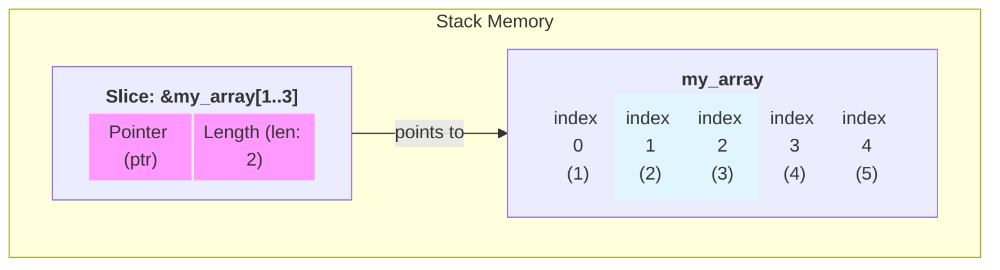

## Slice in Rust

**Key Concept**: Slices in Rust allow you to reference a contiguous sequence of elements in a collection without taking ownership, enabling efficient and safe access to parts of data.

---

### 📚 Fundamental Concepts

Slices are a feature in Rust that provide a view for a part of a collection, such as arrays or strings. They are used to borrow a section of data without taking ownership, which helps in managing memory safely and efficiently.

- **Types of Slices**: Rust primarily has two types of slices: 
  - string slices (`&str`) for strings
  - array slices (`&[T]`) for arrays and vectors.
- **Slice Syntax**: Slices are created using a range syntax, allowing you to specify the start and end indices of the slice. e.g., `&array[start..end]`.
- **Borrowing with Slices**: Slices allow you to borrow a portion of a collection, meaning you can read or manipulate that part without affecting the original data.
- **Immutability and Mutability**: Slices can be either immutable or mutable, depending on how they are declared, which affects whether you can modify the data they reference.

#### Diagram Slice referencing part of an array



---

### 💡 Practical Examples

#### Example 1: Basic Array Slicing

```rust
fn main() {
    let array = [1, 2, 3, 4, 5];
    
    // Using a slice of the array
    // slice syntax: &data[start_index..end_index]
    let slice_array = &array[1..3];
    
    println!("Original array: {:?}", array);
    println!("Array slice: {:?}", slice_array);
}
```

**Explanation**: Array slices allow you to reference a contiguous portion of an array without taking ownership. The syntax `&array[start..end]` creates an immutable reference to elements from `start` (inclusive) to `end` (exclusive). This is memory-efficient since it doesn't copy the data, just creates a view into it.

---

#### Example 2: String Slicing with Function

```rust
/// Returns the first word of the given string slice.
///
/// # Arguments
///
/// * `s` - A string slice from which to extract the first word.
///
/// # Returns
///
/// * A string slice representing the first word in the input string slice.
fn first_word(s: &str) -> &str {
    // Convert the string slice to a byte array
    let bytes = s.as_bytes();

    // Iterate over the byte array to find the first space character
    for (i, &item) in bytes.iter().enumerate() {
        // If a space is found, return the slice from the start to the index of the space
        if item == b' ' {
            return &s[0..i];
        }
    }
    // If no space is found, return the entire string slice
    &s[..]
}

fn main() {
    let my_string = String::from("hello world");

    // Using the first_word function on a String
    let word = first_word(&my_string);
    println!("Original string: {}", my_string);
    println!("The first word is: {}", word);
}
```

**Explanation**: This example demonstrates how string slices work with functions. The `first_word` function takes a string slice (`&str`) and returns a slice containing just the first word. The function iterates through bytes to find the first space, then returns a slice from the beginning to that position using `&s[0..i]`. The `&s[..]` syntax represents the entire string slice if no space is found.

---

#### Example 3: String Slicing with String Literals

```rust
/// Returns the first word of the given string slice.
fn first_word(s: &str) -> &str {
    let bytes = s.as_bytes();

    for (i, &item) in bytes.iter().enumerate() {
        if item == b' ' {
            return &s[0..i];
        }
    }
    &s[..]
}

fn main() {
    let my_string_literal = "hello Rust";

    // Using the first_word function on a string literal
    let word_literal = first_word(my_string_literal);
    println!("Original string literal: {}", my_string_literal);
    println!("The first word is: {}", word_literal);
}
```

**Explanation**: String literals in Rust are already string slices (`&str`), so they work seamlessly with the same `first_word` function. This shows the flexibility of slices. The same function works with both `String` values and string literals because it operates on the slice type, not the concrete collection type.

---

#### Example 4: Bad Example - Dangling References with Slices

```rust
fn first_word(s: &str) -> &str {
    let bytes = s.as_bytes();

    for (i, &item) in bytes.iter().enumerate() {
        if item == b' ' {
            return &s[0..i];
        }
    }
    &s[..]
}

fn main() {
    // Bad example (uncommenting the following lines will cause a compile-time error)
    let mut s = String::from("hello world");
    let word = first_word(&s);
    s.clear(); // This would invalidate the slice `word`
    println!("The first word is: {}", word);
    // We cannot modify `s` while `word` is still in use. This prevents dangling references.
}
```
`Compiler Error:`
```Bash
error[E0502]: cannot borrow `s` as mutable because it is also borrowed as immutable
 --> src/main.rs:10:5
```

**Explanation**: This example demonstrates Rust's protection against dangling references. When you create a slice like `word`, you cannot modify the original `String` while the slice is still in use. Attempting to call `s.clear()` would invalidate the slice, so Rust prevents this at compile time. This is a crucial safety feature that prevents undefined behavior.

---

### ⚠️ Important Points

Common mistakes, pitfalls, and subtleties to keep in mind.

- **Dangling References Prevention**: Slices prevent dangling references because a slice maintains a reference to the borrowed data. You cannot modify the original collection while a slice exists, which ensures the slice remains valid throughout its lifetime.
- **Slice Range Syntax**: The range `&array[n..m]` goes from index `n` to `m-1` (inclusive of `n`, exclusive of `m`). For example, `&array[1..3]` includes indices 1 and 2 but not 3. For strings, the same logic applies.
- **Function Flexibility**: Functions that accept `&str` work with both `String` values (via the `&` operator) and string literals, making your code more flexible and reusable.
- **Critical Point**: Slices are zero-copy abstractions—they don't allocate memory or copy data; they simply create a view into existing data, making them very efficient.

---

### 🔗 Relations and Context

**Related Previous Topics**: 
- [Ownership](01_Ownership.md) - Understanding ownership before learning slices
- [Borrowing](02_Borrowing.md) - Borrowing mechanism that makes slices possible

**Prerequisites**:
- Understanding of ownership and borrowing rules
- Knowledge of how references work in Rust
- Basic understanding of arrays and strings

**Follow-up Topics**:
- [Structs](../03_Structs_Enums/01_Structs.md) - How to define and use structs in Rust.

---

### 📖 References

- [Rust Book - Slices](https://doc.rust-lang.org/book/ch04-03-slices.html)
- [Rust Book - String Slices](https://doc.rust-lang.org/book/ch04-03-slices.html#string-slices)
- [Rust Book - Other Slices](https://doc.rust-lang.org/book/ch04-03-slices.html#other-slices)

