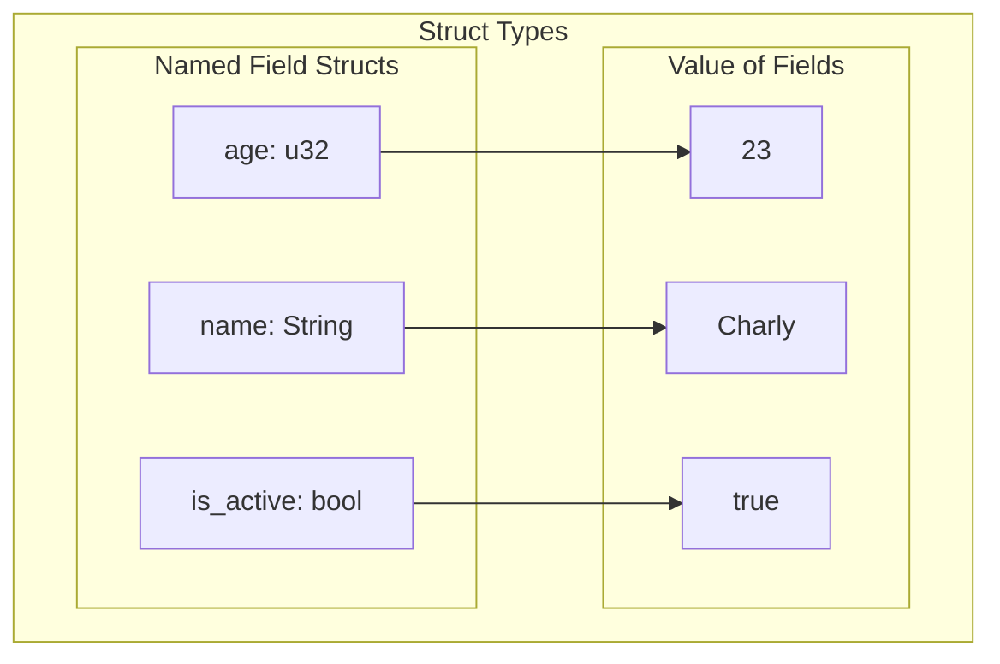

## Structs in Rust

**Key Concept**: Structs in Rust are custom data types that allow you to group related data together. They enable you to create complex data structures with named fields, improving code organization and readability.

---

### 📚 Fundamental Concepts

Structs are a way to create custom data types in Rust by grouping related variables together. They can have named fields or be tuple-like, and they help in organizing data logically.

- **Named Field Structs**: These structs have named fields, making it clear what each field represents. They are useful for complex data where field names improve readability.
- **Tuple Structs**: These are similar to tuples but have a struct name. They are useful when the meaning of the fields is clear from the context, and you want to group data without naming each field.
- **Unit-Like Structs**: These structs have no fields and are used when you need to implement traits on a type but don't need to store data.

#### Diagram: Struct Types



---

### 💡 Practical Examples


#### Example 1: Creating and Accessing Struct Fields

```rust
fn main() {
    // Create an instance of the Student struct with explicit field values
    let student1 = Student {
        active: true,
        name: String::from("Cristian"),
        age: 33,
        grade: 'B',
    };

    // Access and print individual fields using dot notation
    println!("Student Name: {}", student1.name);
    println!("Student Age: {}", student1.age);
    println!("Student Grade: {}", student1.grade);
    println!("Is Active: {}", student1.active);
}
```

**Explanation**: Structs are instantiated by providing values for all fields in the order that makes sense for your logic. Individual fields are accessed using dot notation (`.`). Each field can be accessed independently to retrieve or display its value.

---

#### Example 2: Using Builder Functions and Field Init Shorthand

```rust
struct Student {
    active: bool,
    name: String,
    age: u8,
    grade: char,
}

fn build_student(name: String, age: u8, grade: char) -> Student {
    // Using field init shorthand: when parameter names match field names,
    // you can omit the explicit assignment (name: name becomes just name)
    Student {
        active: true,
        name,
        age,
        grade,
    }
}

fn main() {
    // Create a student using the builder function
    let student2 = build_student(String::from("Eduardo"), 32, 'C');
    
    println!("Student Name: {}", student2.name);
    println!("Student Age: {}", student2.age);
    println!("Student Grade: {}", student2.grade);
}
```

**Explanation**: Builder functions encapsulate struct creation logic, making code more maintainable and reusable. Field init shorthand syntax reduces boilerplate when parameter names match field names. This pattern is especially useful for complex initialization logic or structs with many fields.

---

#### Example 3: Mutable Structs and Modifying Fields

```rust
struct Course {
    title: String,
    credits: u8,
    students_enrolled: u32,
}

fn main() {
    // Create a mutable instance of the Course struct
    let mut course1 = Course {
        title: String::from("Rust Programming"),
        credits: 4,
        students_enrolled: 30,
    };

    // Print original values
    println!("Course Title: {}", course1.title);
    println!("Students Enrolled: {}", course1.students_enrolled);

    // Modify fields of the mutable struct using dot notation
    course1.students_enrolled += 5;
    course1.credits = 3;

    // Print the updated values
    println!("Updated Students Enrolled: {}", course1.students_enrolled);
    println!("Updated Credits: {}", course1.credits);
}
```

**Explanation**: Structs must be declared with `mut` to be mutable. Once mutable, any field can be modified using dot notation. This is useful for updating struct state throughout your program's execution while maintaining type safety.

---

#### Example 4: Struct Update Syntax

```rust
struct Student {
    active: bool,
    name: String,
    age: u8,
    grade: char,
}

fn main() {
    let student1 = Student {
        active: true,
        name: String::from("Cristian"),
        age: 33,
        grade: 'B',
    };

    // Create a new student using the update syntax (..)
    // Copy the active and name fields from student1, override age and grade
    let student2 = Student {
        age: 28,
        grade: 'A',
        ..student1  // Use remaining fields from student1
    };

    println!("Student 1 Name: {}", student1.name);
    println!("Student 2 Name: {}", student2.name);
    println!("Student 2 Age: {}", student2.age);
    println!("Student 2 Grade: {}", student2.grade);
    // Note: student1.name is no longer accessible here because String was moved
}
```

**Explanation**: Struct update syntax (`..struct`) allows creating a new instance based on an existing one, overriding specific fields. This is convenient for creating variants of structs without repeating all field values. However, fields that implement `Move` (like `String`) are transferred to the new instance, making the original variable partially inaccessible.

---

#### Example 5: Tuple Structs

```rust
// Tuple struct definition - useful when field meaning is clear from context
struct Point(i32, i32, i32);
struct Color(u8, u8, u8);

fn main() {
    // Create instances of tuple structs
    let point1 = Point(10, 20, 30);
    let point2 = Point(5, 15, 25);
    let red = Color(255, 0, 0);

    // Access tuple struct fields by index using dot notation
    println!("Point 1 coordinates: x: {}, y: {}, z: {}", 
             point1.0, point1.1, point1.2);
    println!("Point 2 coordinates: x: {}, y: {}, z: {}", 
             point2.0, point2.1, point2.2);
    println!("Red color values: R: {}, G: {}, B: {}", 
             red.0, red.1, red.2);
}
```

**Explanation**: Tuple structs are lighter-weight than named-field structs when the field meaning is obvious from context or type. They combine the benefits of tuples (simple syntax) and structs (giving the type a meaningful name). Access fields by numeric index just like tuples, which adds clarity that these are positional parameters.

---

### ⚠️ Important Points

- **Ownership and Move Semantics**: When creating a new struct instance using update syntax (`..struct`), fields that don't implement the `Copy` trait (like `String`) are moved to the new instance. This means the original variable can no longer be used for those fields. Always be aware of which fields implement `Copy` vs `Move` semantics to avoid unexpected compile errors.

- **Mutability is Per-Struct**: You cannot mark individual fields as mutable; you must mark the entire struct instance with `mut`. If the entire struct is immutable, all of its fields are immutable, and vice versa.

- **All Fields Are Required**: When creating a struct instance, you must provide values for ALL fields unless using the update syntax (`..`). There is no concept of default values in basic struct definitions. Missing a field will result in a compile-time error.

- **Borrowing Structs**: When passing structs to functions, consider using references (`&Student`) instead of transferring ownership. This allows multiple parts of your code to access the struct without moving ownership. Functions that only read struct data should take immutable references to preserve usability after the function call.

- **Field Access with Dot Notation**: The dot operator automatically dereferences through references and dereferences mutable references as needed, making it convenient to access fields without explicit dereferencing. This works seamlessly whether you have `student` or `&student`.

- **Tuple Structs vs Named Structs**: While tuple structs have simpler syntax, they can reduce code readability since fields are accessed by index rather than name. Use named-field structs when fields have semantic meaning, and tuple structs only when the field meaning is obvious from context or type.

---

### 🔗 Relations and Context

**Related Previous Topics**: 
- [Ownership](../02_Ownership_System/01_Ownership.md) - Ownership rules and move semantics that affect struct fields
- [Borrowing](../02_Ownership_System/02_Borrowing.md) - Borrowing and references when passing structs to functions
- [Variables and Mutability](../01_Fundamentals/02_Variables.md) - Primitive and compound types used as struct fields

**Prerequisites**:
- Familiarity with ownership and move semantics
- Understanding of references and borrowing
- Basic knowledge of primitive and compound types (`String`, integers, `char`)

**Follow-up Topics**:
- [Method Syntax](02_Structs_Methods.md) - Implementing methods and associated functions on structs

---

### 📖 References

- [Rust Book - Defining Structs](https://doc.rust-lang.org/stable/book/ch05-01-defining-structs.html)
- [Rust Book - Example: Using Structs](https://doc.rust-lang.org/stable/book/ch05-02-example-structs.html)
- [Rust Book - Method Syntax](https://doc.rust-lang.org/stable/book/ch05-03-method-syntax.html)
- [Rust Reference - Structs](https://doc.rust-lang.org/reference/items/structs.html)

