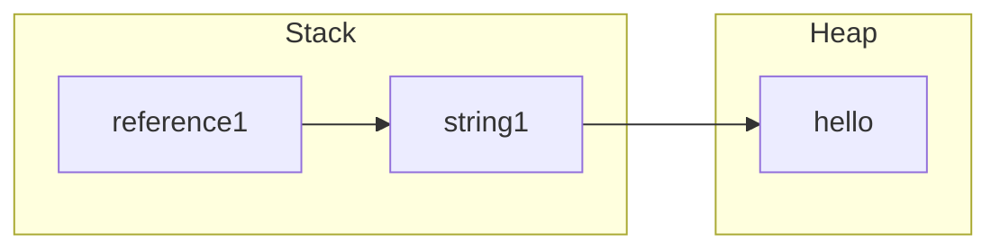

## Understanding Borrowing in Rust

Borrowing is a fundamental concept in Rust that allows you to access data without taking ownership of it. This mechanism is crucial for ensuring memory safety while enabling flexible data access patterns. In this article, we will explore how borrowing works in Rust, the difference between mutable and immutable references, and the rules that govern them.

### References

When we discussed ownership in the previous article, we saw how transferring ownership of a variable can lead to situations where the original owner can no longer access the data. Rust provides a way to access data without taking ownership through references.
A reference is a way of passing a pointer to some data without transferring ownership.

e.g., consider the following code:

```rust
let string1 = String::from("hello");
let reference1 = &string1; // Immutable reference to string1
```

Now see how this works on memory:


Now we can understand that `reference1` is a reference to `string1`, which in turn points to the actual string data on the heap. Importantly, `reference1` does not own the data; it merely borrows it.

### Immutable References

By default, references in Rust are immutable. This means that when you create a reference to a variable, you cannot modify the data through that reference.
For example:

```rust
let my_string = String::from("hello");
let reference1 = &my_string; // Immutable reference
```
Here, `reference1` is an immutable reference to `my_string`. You can read the data through `reference1`, but you cannot change it. Attempting to do so will result in a compile-time error.
We can have multiple immutable references to the same data at the same time:

```rust
let my_string = String::from("hello");
let reference1 = &my_string; // Immutable reference 1
let reference2 = &my_string; // Immutable reference 2
println!("Original string: {}", my_string);
println!("Reference 1: {}", reference1);
println!("Reference 2: {}", reference2);
```
Both `reference1` and `reference2` can coexist without any issues since they are both immutable.

### Mutable References

Now imagine we want to modify our variable in another function and keep using it after that. For this, we need mutable references. Mutable references allow you to change the data they point to.
To create a mutable reference, you use the `&mut` syntax:

```rust
fn modify_string(s: &mut String) {
    s.push_str(", world");
}
fn main() {
let mut my_string = String::from("hello"); // Note the `mut` keyword, if we don't use it, we cannot create mutable references
modify_string(&mut my_string); // Pass a mutable reference
println!("Modified string: {}", my_string);
}
```

In this example, the `modify_string` function takes a mutable reference to a `String` and appends ", world" to it. The `main` function creates a mutable `String` and passes a mutable reference to it.

### Rules of References

Rust enforces strict rules regarding references to ensure memory safety:

1. You can have any number of immutable references to a particular piece of data.
2. You can have only one mutable reference to a particular piece of data at a time.
3. You cannot have mutable and immutable references to the same data at the same time.
4. If we have a mutable reference, the original variable cannot be used until the mutable reference goes out of scope.
5. If you wish to create a immutable references after using a mutable reference, you must ensure that the mutable reference is no longer in use.

These rules prevent data races at compile time, ensuring that your programs are safe and free from common memory-related bugs. At the same time, preventing dangling references is another key aspect of Rust's borrowing system. A dangling reference occurs when a reference points to data that has been deallocated. Rust's ownership and borrowing rules ensure that references are always valid for the duration of their use.

### Conclusion

Borrowing is a powerful feature in Rust that allows safe access to data without transferring ownership. By understanding the concepts of immutable and mutable references, along with the rules that govern them, you can write efficient and safe Rust programs. Rust's borrowing system ensures memory safety while providing flexibility in how data is accessed and modified, making it a key aspect of Rust's overall design philosophy.

